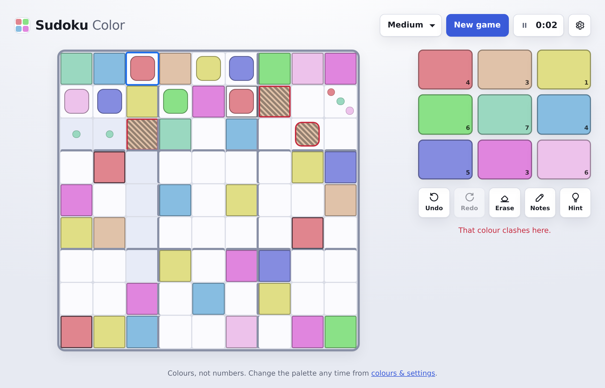

# Sudoku Color

Sudoku, but the nine symbols are colours instead of digits. It ships with a
pastel palette, five more presets — including a colour-blind safe one and a grey
scale — and an editor for picking your own nine colours.

No build step, no dependencies: it is plain HTML, CSS and ES modules.



## Play

Open `index.html` through any static web server (ES modules do not load from
`file://`):

```sh
npm start          # python3 -m http.server 8080
# or: npx serve .
```

Then visit <http://localhost:8080>.

### How it works

Pick a colour from the palette, then tap the cells it belongs in — or tap a cell
first and then a colour. Tapping a cell that already holds the armed colour
clears it again. Each colour goes once per row, once per column and once per box,
exactly as with digits.

Cells that came with the puzzle fill edge to edge. Your own entries sit in a
rounded square inside the cell, so you can always tell the two apart without
relying on colour.

| Key | Does |
| --- | --- |
| `1`–`9` | Place that colour in the selected cell |
| Arrow keys | Move around the board |
| `Backspace`, `Delete`, `0` | Clear the selected cell |
| `N` | Pencil marks on or off |
| `Z` / `Y` | Undo / redo |
| `H` | Reveal one colour |
| `P` | Pause |
| `S` | Open colours & settings |
| `Esc` | Un-arm the current colour |

Pencil marks show as small dots, one per possible colour. Placing a colour
clears that mark from every cell in the same row, column and box.

Your board, palette and best times are kept in `localStorage`, so closing the
tab does not lose the game. In a browser that blocks storage the app still runs,
it just forgets between sessions.

## Colours


Six presets ship with the app:

| Preset | For |
| --- | --- |
| **Pastel** | The default. Soft tones, tuned so no two are close. |
| **Vibrant** | Saturated and high-energy. |
| **Colour-blind safe** | Okabe–Ito based; stays readable without red/green vision. |
| **Blue-blind safe** | For tritanopia; avoids blue/yellow confusions. |
| **Grey scale** | Nine steps of lightness, for playing without colour at all. |
| **Neon** | Bright colours built for the dark theme. |

Beyond the presets you can set each of the nine colours individually with a
colour picker or a hex value, shuffle their order, and save the result as a
preset of your own.

### Making the board readable

Colour alone is not enough for everyone, so the palette is only one of the cues:

- **Symbols.** Numbers, letters or shapes can be drawn on top of every colour.
  The ink is picked automatically per swatch, always at 4.5:1 contrast or better.
- **A warning when colours are too close.** Custom palettes are checked in CIE
  L\*a\*b\* space; if two swatches land within ΔE 18 the settings sheet names the
  pair and offers to switch symbols on. (Grey scale trips this by design — nine
  steps of one hue cannot be far apart, which is why that preset recommends
  symbols.)
- **A ring on every filled cell**, in a darker or lighter shade of the fill,
  whichever separates further. A white swatch still reads as filled.
- **Clashes marked twice over**: a red ring *and* a diagonal hatch drawn in the
  cell's own ink, so the warning does not depend on seeing red.
- **Shape, not just colour**, for givens versus your own entries.

The board is a `role="grid"` of buttons: every cell is reachable from the
keyboard, carries a spoken label like "row 4, column 7, colour 3, given", and
selection follows focus. Light and dark themes both follow the system setting by
default, and everything respects `prefers-reduced-motion`.


## Difficulty

Puzzles are generated on the fly and always have exactly one solution. Cells are
removed in pairs symmetric about the centre, and every removal is checked for
uniqueness before it is kept.

Difficulty is not just a clue count — each candidate is then run through a solver
that only knows human techniques, and accepted when the hardest technique it
needs matches the band:

| Level | Clues | Hardest technique needed |
| --- | --- | --- |
| Easy | ~42 | naked singles |
| Medium | ~34 | hidden singles |
| Hard | ~29 | locked candidates (pointing / claiming) |
| Expert | ~25 | beyond those — chains and guessing |

## Layout

```
index.html              markup and the two dialogs
styles/main.css         tokens, layout, board; per-colour rules at the end
src/sudoku.js           generation, solving, difficulty rating, validation
src/palettes.js         presets, colour maths, perceptual distance
src/game.js             board state, pencil marks, undo, timer, win detection
src/storage.js          localStorage, defensive on every read
src/theme.js            settings -> CSS custom properties
src/ui.js               board and palette rendering
src/settings.js         the colours & settings sheet
src/app.js              wiring, keyboard, persistence
tests/                  node:test suites
```

`src/sudoku.js`, `src/palettes.js`, `src/game.js` and `src/storage.js` have no
DOM dependencies, which is what makes them testable in plain Node.

## Tests

```sh
npm test
```

66 tests over the engine (uniqueness, ratings, conflicts, seeded repeatability),
the colour maths (contrast, perceptual distance, palette validation), the game
state machine (undo across notes, win detection, snapshot round-trips) and
storage (every corrupt-input path).

## Deploying

It is a static site — serve the repository root as-is. For GitHub Pages, enable
Pages on the branch and set the folder to `/` (root); no build step is involved.

## Licence

MIT.
