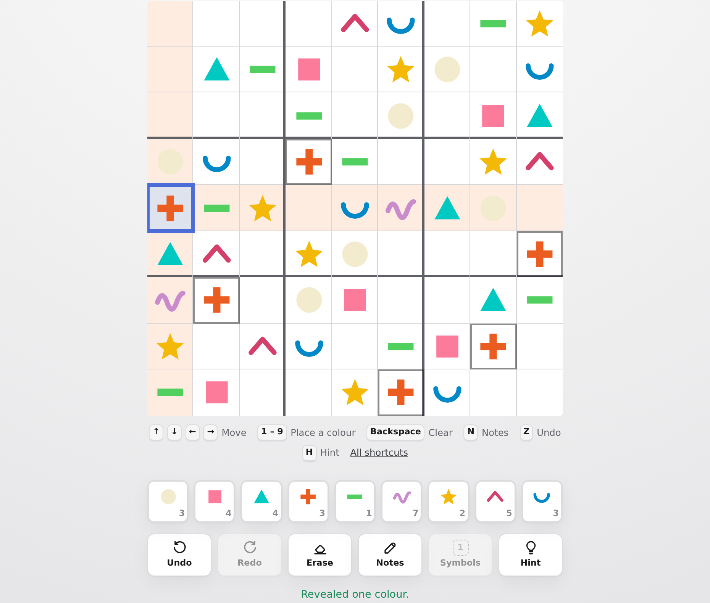
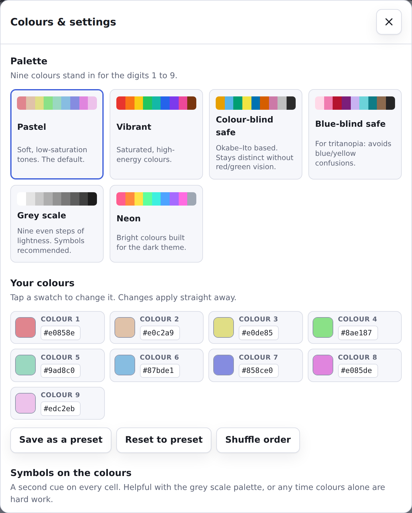
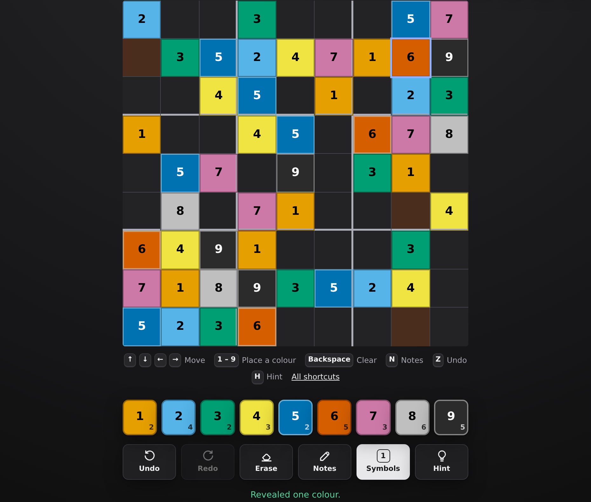

# UniversalSudoku

**[Play it](https://neuronids.github.io/UniversalSudoku/)**

Sudoku, but the nine symbols are colours instead of digits. It ships with eight
palettes — including a colour-blind safe one and a grey scale — an editor for
picking your own nine colours, and the option of playing by shape instead.

No build step, no dependencies: it is plain HTML, CSS and ES modules.



## Play

It is live at <https://neuronids.github.io/UniversalSudoku/> — nothing to
install, and it keeps your game in the browser you opened it in.

To run it yourself, open `index.html` through any static web server (ES modules
do not load from `file://`):

```sh
npm start          # python3 -m http.server 8080
# or: npx serve .
```

Then visit <http://localhost:8080>.

### How it works

Pick a colour from the palette, then tap the empty cells it belongs in. Each
colour goes once per row, once per column and once per box, exactly as with
digits.

The colour stays armed so you can sweep the board with it, and it only ever
lands in an empty cell. Tapping a cell that already holds something — a given or
one of your own entries — selects it and puts the colour down instead, so you
can look at a cell, and at everything sharing its row, column and box, without
editing it by accident. Pressing anywhere away from the board and its controls
does the same, as does `Esc`. Clearing a cell is the Erase button or
`Backspace`.

Every cell is drawn the same way, whether the puzzle came with it or you put it
there yourself — one flat colour, edge to edge, on a board with no frame around
it and unbroken lines between the nine boxes.

| Key | Does |
| --- | --- |
| Arrow keys | Move one cell |
| `Home` / `End` | Start or end of the row |
| `Page Up` / `Page Down` | Top or bottom of the column |
| `[` / `]` | Previous or next empty cell |
| `Tab` | Leave the board |
| `1`–`9` | Place that colour in the selected cell |
| `Backspace`, `Delete` | Clear the selected cell |
| `N` | Pencil marks on or off |
| `Z` / `Y` | Undo / redo |
| `H` | Reveal one colour |
| `C` | Check the board against the solution |
| `T` | Symbols on or off |
| `G` | New game |
| `P` | Pause |
| `S` | Open colours & settings |
| `?` | The shortcut list |
| `Esc` | Put the current colour down |

The basics are printed under the board as well, so there is no need to go
looking for them — turn that bar off under Assists if you would rather not have
it. Every shortcut can be moved to a different key, placing a colour included:
open the settings sheet, go to **Keyboard shortcuts**, pick one and press the
key you want it on (`Esc` gives up on the change). Binding a key that another
shortcut was using takes it away from that one, which is then shown as "Not set"
until you give it a key of its own.

Any key will do, `Tab` and the digits included. The only ones held back are the
modifiers, which are never a press on their own, and `Enter` and `Space`, which
are how a focused button is pressed anywhere on the page. Binding `Tab` does
cost you the usual way of stepping out of the board to the palette and buttons —
the sheet says so, and `[` and `]` still jump between empty cells.

The board follows the ARIA grid pattern: the whole grid is a single tab stop
with a roving `tabindex`, so `Tab` moves *out* of it to the palette and buttons
rather than between cells. `[` and `]` do the jumping between empty cells that
`Tab` handles in some other sudoku apps.

Pencil marks show as small dots, one per possible colour. Placing a colour
clears that mark from every cell in the same row, column and box.

Picking a colour — from the palette or with `1`–`9` — outlines every cell that
already holds it, so you can sweep the board for one colour without having to
find a cell containing it first. Selecting a cell that holds a colour highlights
that one instead.

### Shapes instead of colours

Under **How a cell is drawn**, "Shapes" swaps the flooded colour for the shape
that belongs to that number — circle, square, triangle, plus, minus, wave, star,
chevron and smile, the nine post-it shapes — drawn in the number's colour on a
plain cell. Pencil marks become miniatures of the same shapes.

**Turn colour off** goes one step further and draws every shape in a single ink.
That turns shapes on for you, because nine identical black squares would not be
a board: with colour gone the shape has to carry the whole value.

### Sending a puzzle to someone

The generator is deterministic — the same difficulty and seed always build the
same board — so a puzzle travels as nothing more than a link:

```
https://…/index.html#puzzle=medium-2121049817
```

Press the share button in the toolbar and you get that link for the board you
are on. Whoever opens it plays the identical puzzle, with their own colours and
their own clock; nothing is uploaded and there is no server involved. Reopening
your own link picks up where you left off rather than restarting, and starting a
new game drops the link from the address bar. An unreadable or hand-edited
fragment just starts an ordinary game.

Your board, palette and best times are kept in `localStorage`, so closing the
tab does not lose the game. In a browser that blocks storage the app still runs,
it just forgets between sessions.

## Colours



Eight presets ship with the app:

| Preset | For |
| --- | --- |
| **Default** | The spectrum in order, yellow round to green. |
| **10 + 2** | Nine colours picked to stay well apart from one another. |
| **Pastel** | Soft tones, tuned so no two are close. |
| **Vibrant** | Saturated and high-energy. |
| **Colour-blind safe** | Okabe–Ito based; stays readable without red/green vision. |
| **Blue-blind safe** | For tritanopia; avoids blue/yellow confusions. |
| **Grey scale** | Nine steps of lightness, for playing without colour at all. |
| **Neon** | Bright colours built for the dark theme. |

Each of the nine numbers gets one colour, and the editor shows that mapping
directly: the swatch is stamped with its number, and you set its colour with a
picker or a hex value. `⇄` trades two numbers' colours — click it on one number,
then on the number you want to trade with. You can also shuffle the order at
random, and save the result as a preset of your own.

### Making the board readable

Colour alone is not enough for everyone, so the palette is only one of the cues:

- **Shapes.** Every number has a shape as well as a colour, and the board can be
  drawn with shapes instead of fills — or with shapes alone, colour off.
- **Symbols.** Numbers or letters can be drawn on top of every colour,
  toggled from the board with the Symbols button or `T` — it brings back the set
  you last used rather than always jumping to numbers. The ink is picked
  automatically per swatch, always at 4.5:1 contrast or better.
- **A warning when colours are too close.** Custom palettes are checked in CIE
  L\*a\*b\* space; if two swatches land within ΔE 18 the settings sheet names the
  pair and offers to switch symbols on. (Grey scale trips this by design — nine
  steps of one hue cannot be far apart, which is why that preset recommends
  symbols.)
- **A ring on every filled cell**, in a darker or lighter shade of the fill,
  whichever separates further. A white swatch still reads as filled.
- **Clashes marked twice over**: a red ring *and* a diagonal hatch drawn in the
  cell's own ink, so the warning does not depend on seeing red.
- **"Tell me when it's wrong."** On by default. Flagging clashes only catches a
  colour that repeats in a row, column or box; this one compares against the
  solution, so anything wrong is marked and named the moment you put it down,
  clash or no clash, and a wrong colour cannot sit quietly on the board for
  twenty minutes. Switch it off for an unassisted game. `C` asks the same
  question once, without leaving the marks on.

The board is a `role="grid"` of buttons: every cell is reachable from the
keyboard, carries a spoken label like "row 4, column 7, number 3, given", and
selection follows focus. Labels name the *number*, never the colour — a colour
name tells a screen-reader user nothing, and the number stays stable when the
palette or symbol set changes. Light and dark themes both follow the system setting by
default, and everything respects `prefers-reduced-motion`.



## Difficulty

Puzzles are generated on the fly and always have exactly one solution. Cells are
removed in pairs symmetric about the centre, and every removal is checked for
uniqueness before it is kept.

Difficulty is not just a clue count — each candidate is then run through a solver
that only knows human techniques, and accepted when the hardest technique it
needs matches the band:

| Level | Clues | Hardest technique needed |
| --- | --- | --- |
| Easy | ~42 | naked singles |
| Medium | ~34 | hidden singles |
| Hard | ~29 | locked candidates (pointing / claiming) |
| Expert | ~25 | beyond those — chains and guessing |

## Layout

```
index.html              markup and the dialogs
styles/main.css         tokens, layout, board; per-colour rules at the end
src/sudoku.js           generation, solving, difficulty rating, validation
src/palettes.js         presets, colour maths, perceptual distance
src/shapes.js           the nine post-it shapes, as SVG paths
src/keymap.js           the bindings, and the rules for rebinding them
src/game.js             board state, pencil marks, undo, timer, win detection
src/storage.js          localStorage, defensive on every read
src/navigation.js       board movement maths: edges, wrap-around, empty cells
src/share.js            puzzle links: formatting and parsing the URL fragment
src/theme.js            settings -> CSS custom properties
src/ui.js               board and palette rendering
src/settings.js         the colours & settings sheet
src/app.js              wiring, keyboard, persistence
tests/                  node:test suites
```

`src/sudoku.js`, `src/palettes.js`, `src/game.js`, `src/storage.js`,
`src/navigation.js`, `src/keymap.js` and `src/share.js` have no DOM dependencies, which is what
makes them testable in plain Node.

## Tests

```sh
npm test
```

110 tests over the engine (uniqueness, ratings, conflicts, seeded repeatability),
the colour maths (contrast, perceptual distance, palette validation), the game
state machine (undo across notes, win detection, snapshot round-trips), board
navigation (edge clamping, wrap-around, full boards), puzzle links (round-trips
and every malformed fragment) and storage (every corrupt-input path).

## Deploying

It is a static site — serve the repository root as-is. There is nothing to
build, so there is nothing to configure.

`.github/workflows/pages.yml` does it on GitHub Pages: every push to the
default branch runs the tests, uploads the repository root and deploys it, so
the game is at `/`. The workflow turns Pages on the first time it runs; if your token cannot do that, set **Settings →
Pages → Source** to **GitHub Actions** once and re-run it. Deploying from a
branch instead works just as well — pick the branch and `/` (root) — the
workflow only adds the tests and saves the click.

The absolute URLs in the `og:` tags of `index.html` name `neuronids.github.io`;
they only matter for how a shared link previews, but they are what to change if
the site moves to a domain of its own.

## Licence

MIT.
